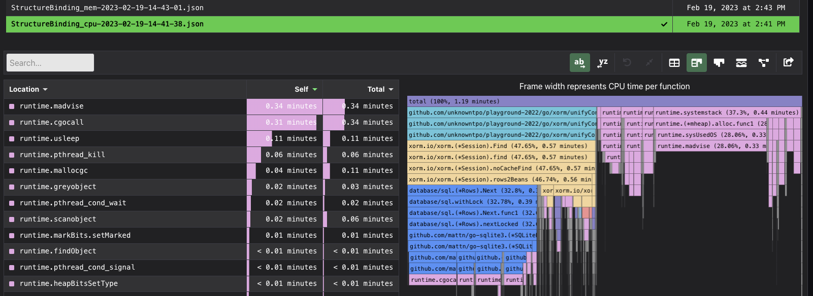
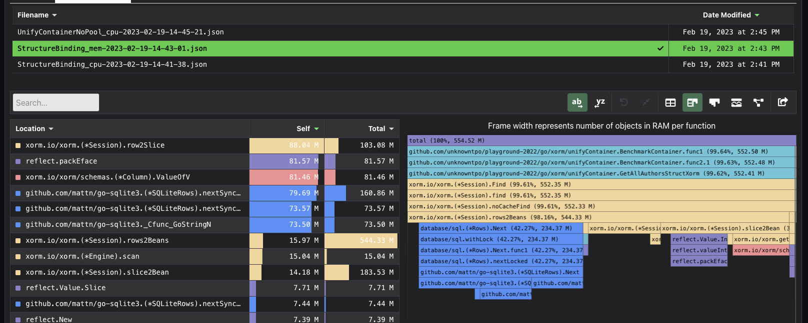
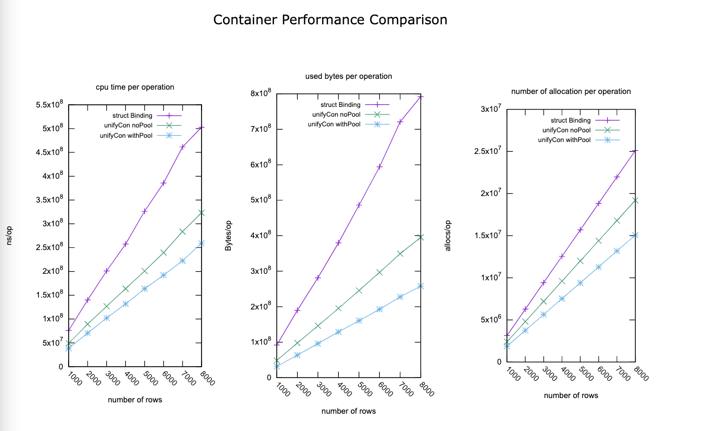

# Identifying the problem

Our service is like a excel document datastore.
and we use `xorm` as ORM framework,
Everytime we need to get data from DB, we call `session.Find(&[]Author{})` with the slice of table beans,
but this have a problem,

- Memory allocation is very high

So every time lots of clients try to download excel file,
the memory consumption is too high, and downloadling excel file takes too long to complete.

## Find the root cause with pprof

I wrote a benchmark and by leveraging GO's pprof profiling tool, we can easily check out the flamegraph
using some tool like pyroscope.

Here's the result we got:

### CPU



### Memory Allocation


We can see that under the frame of `(*Session).rows2Beans`,
except the function underneath `xorm` framework that we can't touch,
`(*Session).slice2Bean` took a lot of CPU time and had lot of
memory allocation.

#### Structure Binding
In [src of structure-binding](https://gitea.com/xorm/xorm/src/commit/bd58520020dfb5bd6b7f5779e871d53aa9ee4c71/session_find.go#L235-L247)


#### With `[][]string`


If the cache


## Step 1: Use `[][]string` to hold the data
Based on the assumption, we can use `[][]string` to reduce the cost of structure binding, you can see the benchmark below `unifyContainerNoPool` 
.

## Step 2: Use sync.Pool to reduce memory allocation

But it still need huge amount of memory allocation for every `[]string` and every `[][]string`, let's see how we can reduce this cost.

The solution I came out is very simple, if memory allocation is time-consuming,
why don't we reuse the data structure in memory ? In this case,
we're using `[][]string`

```
var unifyContainerRowPool = sync.Pool{
	New: func() interface{} {
		conRow := make([]string, DefaultContainerColLen)
		conRow = resetUnifyContainerRow(conRow)
		return conRow[:0]
	},
}

var unifyContainerPool = sync.Pool{
	New: func() interface{} {
		// fmt.Println("New is called for unifyContainerPool")
		con := make([][]string, 0, DefaultContainerRowLen)
		return con
	},
}
```

## Experiment:

To demonstrate the improvement of our code, I design a simple benchmark,

There are three ways we can get data from database.

- Use `[]Author` to hold the data (Structure Binding)
- Use `[][]string` to hold the data (Unify Container without `sync.Pool`)
- Use `[][]string` to hold the data, and use sync.Pool to reuse `[][]string` (Unify Container with sync.Pool)

For row number between `1000` and `8000`
to demonstrate the benefit of `sync.Pool`,
we use `runtime.NumCPU()` worker to perform `runtime.NumCPU()*4` jobs, every job gets all rows from the `author` table


```
$ make BENCHTIME=1s
go test -benchmem -benchtime=1s \
                -bench=. \
                | tee data/result_all.txt
goos: darwin
goarch: arm64
pkg: github.com/unknowntpo/playground-2022/go/xorm/unifyContainer
BenchmarkContainer/StructureBinding-1000-8                    13          78949647 ns/op        91926655 B/op 3146081 allocs/op
BenchmarkContainer/UnifyContainerWithPool-1000-8              31          39028380 ns/op        31799634 B/op 1882362 allocs/op
BenchmarkContainer/UnifyContainerNoPool-1000-8                22          48651809 ns/op        48547759 B/op 2407600 allocs/op
BenchmarkContainer/StructureBinding-2000-8                     8         137213729 ns/op        189730109 B/op 6284178 allocs/op
BenchmarkContainer/UnifyContainerWithPool-2000-8              15          72343683 ns/op        63592857 B/op 3759864 allocs/op
BenchmarkContainer/UnifyContainerNoPool-2000-8                12          87559920 ns/op        97780912 B/op 4807668 allocs/op
BenchmarkContainer/StructureBinding-3000-8                     6         199308167 ns/op        281507561 B/op 9422225 allocs/op
BenchmarkContainer/UnifyContainerWithPool-3000-8              10         105695333 ns/op        97377107 B/op 5654077 allocs/op
BenchmarkContainer/UnifyContainerNoPool-3000-8                 8         128159927 ns/op        146226483 B/op 7207695 allocs/op
BenchmarkContainer/StructureBinding-4000-8                     4         256713490 ns/op        379839898 B/op12560279 allocs/op
BenchmarkContainer/UnifyContainerWithPool-4000-8               8         140550521 ns/op        129773817 B/op 7537186 allocs/op
BenchmarkContainer/UnifyContainerNoPool-4000-8                 7         165150417 ns/op        195457696 B/op 9607724 allocs/op
BenchmarkContainer/StructureBinding-5000-8                     4         323341906 ns/op        486299350 B/op15698332 allocs/op
BenchmarkContainer/UnifyContainerWithPool-5000-8               7         162782482 ns/op        163561488 B/op 9417513 allocs/op
BenchmarkContainer/UnifyContainerNoPool-5000-8                 5         200822450 ns/op        245477224 B/op12007762 allocs/op
BenchmarkContainer/StructureBinding-6000-8                     3         404629153 ns/op        594317120 B/op18836278 allocs/op
BenchmarkContainer/UnifyContainerWithPool-6000-8               6         195379785 ns/op        195452422 B/op11307507 allocs/op
BenchmarkContainer/UnifyContainerNoPool-6000-8                 4         258140198 ns/op        296804806 B/op14407787 allocs/op
BenchmarkContainer/StructureBinding-7000-8                     3         512568570 ns/op        720955394 B/op21974306 allocs/op
BenchmarkContainer/UnifyContainerWithPool-7000-8               4         251422083 ns/op        224965602 B/op13170581 allocs/op
BenchmarkContainer/UnifyContainerNoPool-7000-8                 4         288070792 ns/op        349445756 B/op16807820 allocs/op
BenchmarkContainer/StructureBinding-8000-8                     2         531542583 ns/op        792064800 B/op25112484 allocs/op
BenchmarkContainer/UnifyContainerWithPool-8000-8               4         271685614 ns/op        260817526 B/op15089126 allocs/op
BenchmarkContainer/UnifyContainerNoPool-8000-8                 4         338913490 ns/op        395270596 B/op19207827 allocs/op
PASS
ok      github.com/unknowntpo/playground-2022/go/xorm/unifyContainer    46.676s
```

The result shows that the number of allocation per operation is quite different,

The Structure Binding Method needs the largest number of allocations, and the speed is way slower that other two methods. When row number goes high, performance get worse very quickly.

The Method of using `[][]string` with `sync.Pool` on the other hand, 
needs smallest number of memory allocation,
and compare to the one without `sync.Pool`, and because memory allocation takes significant amount of time, it's still faster.

Here's the plot:



I put my code at the [repo](https://github.com/unknowntpo/playground-2022/tree/master/go/xorm/unifyContainer), please go check it out!

## Reference
### Source code: Structure-Binding {#my-anchor} 
